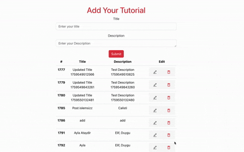
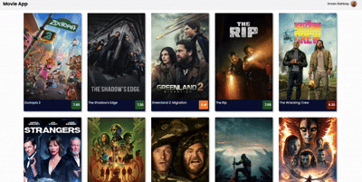
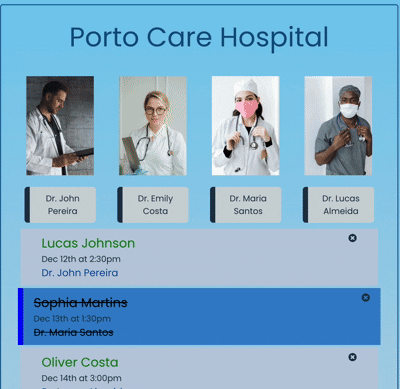
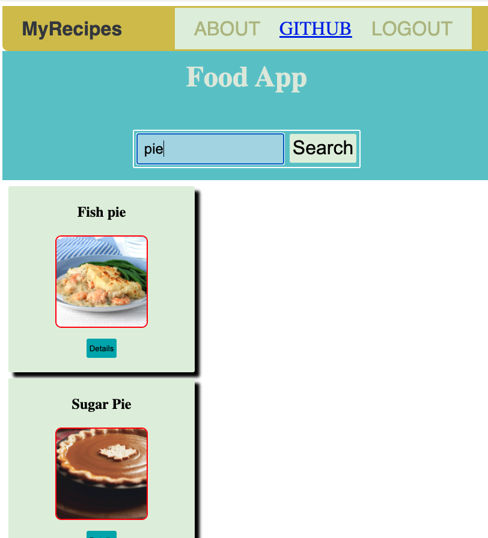
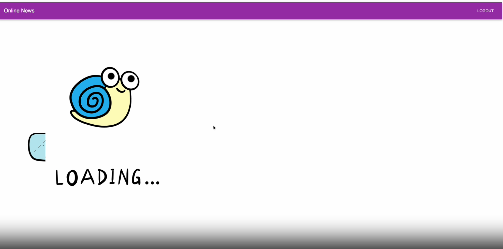
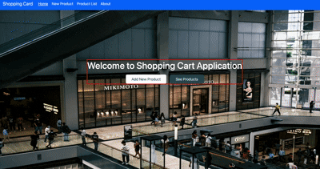

### Hi there !
- I'm a Full Stack Developer based in Porto, Portugal, skilled in JavaScript, Java, and TypeScript.
-  I work with a variety of technologies including React.js, Node.js, Express.js, Next.js, Redux, Context API, Tailwind CSS, PostgreSQL, MongoDB and Spring Boot.I'm also proficient with tools such as GitHub, Firebase, Postman, and have experience with JWT, bcrypt, Prisma ORM, Material UI, Radix UI, Lambda, and OOP principles.

---

#### 🧠 Profile Summary Cards

<table>
  <tr>
    <td>
      
    </td>
    <td>
           
    </td>
  </tr>
</table>

---
### 🚀 My Projects

For more, check out my GitHub repositories!

| #  | Type       | Project Name | Tech Stack | Project Preview |
| :-: | :--------: | :----------: | :---------: | :-------------: |
| 8  | Back-End  | <a href="https://github.com/ImrenR/team-management" target="_blank">Team Management App</a> | Next.js, Prisma ORM, PostgreSQL, bcrypt, JWT |  |
| 7  | Front-End   | <a href="https://tutorialapp-gamma.vercel.app/" target="_blank">CineScope</a> | React, JavaScript,Crud,Bootstrap,React-Icons,Axios, Restful API |  |
| 6  | Front-End   | <a href="https://cinescope-alpha.vercel.app/" target="_blank">CineScope</a> | React19, JavaScript,Firebase-Auth,Tailwind CSS,React-Toastif-Context Api |  |
| 5  | Front-End   | <a href="https://hospital-app-wheat.vercel.app/" target="_blank">Hospital App</a> | React19, JavaScript,React Icons,Simple UUID |  |
| 4  | Front-End   | <a href="https://taste-api.vercel.app/" target="_blank">Taste API</a> | React, JavaScript, Axios, Vite |  |
| 3  | Front-End   | <a href="https://online-newspaper-app-with-redux.vercel.app/login" target="_blank">Online Newspaper</a> | React, JavaScript, Redux-thunk, Vite |  |
| 2  | Front-End   | <a href="https://react-shoppingcard.vercel.app/" target="_blank">React Shopping Card</a> | React19, Vite, JavaScript, Axios,Redux,RestAPI,Material UI |  |
| 1  | Front-End   | <a href="https://legends-united-app.vercel.app/" target="_blank">Legend United App</a> | React, JavaScript, Bootstrap5, Vitejs |  |
