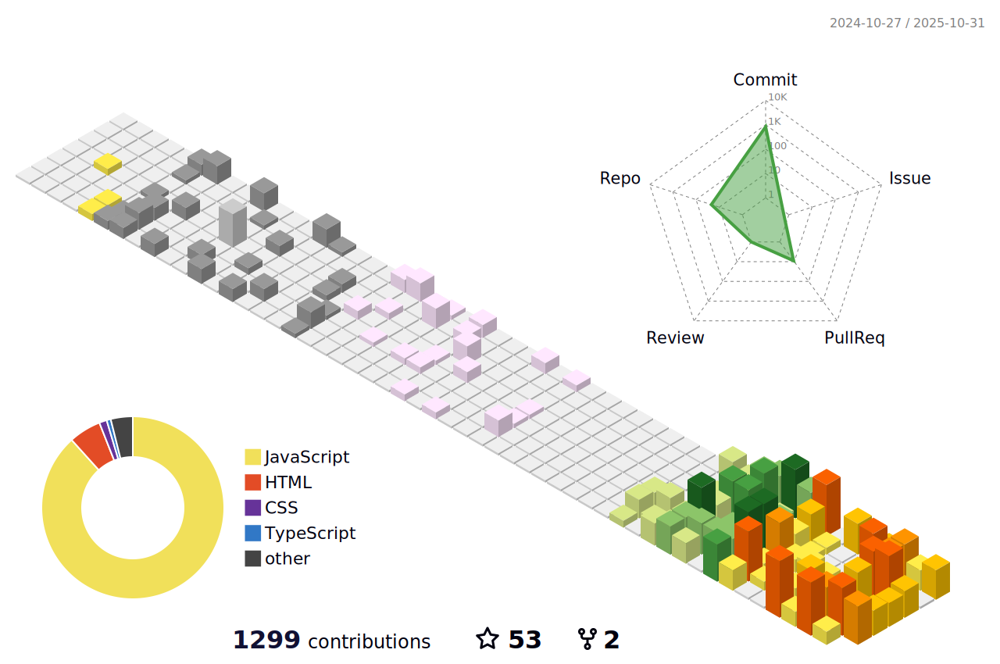

### Hi there 👋

## 👩‍💻 About Me

Hi and welcome to my GitHub Profile! I enjoy building clean, scalable applications using modern frameworks like React, Next.js, and Node.js. I'm always exploring new technologies and improving my craft one line of code at a time.

## 🧱 3D GitHub Contribution Calendar

---

## 🧰 Technologies That I Know

<table>
  <tr>
    <td><b>Programming Languages:</b></td>
    <td>
      
      
       
      javascript • typescript 
    </td>
  </tr>
  <tr>
    <td><b>Frontend</b></td>
    <td>
      
      
      
      
      
      
       
      react.js • next.js • redux • html • css • javaScript 
    </td>
  </tr>
  <tr>
    <td><b>Backend</b></td>
    <td>
      
      
       
      node.js • express.js 
    </td>
  </tr>
  <tr>
  </tr>
  <tr>
    <td><b>Styling</b></td>
    <td>
      
      
      
      
      
      
       
      css • sass • tailwind • materialUI • bootstrap • styled-components
    </td>
  </tr>
  <tr>
  </tr>
  <tr>
    <td><b>Database</b></td>
    <td>
      
      
      
      
       
      SQLite • sequelize • mongoDB • postgreSQL
    </td>
  </tr>
  <tr>
    <td><b>Tools</b></td>
    <td>
      
      
      
       
      webstorm • vscode • git • npm • 
    </td>
  </tr>
</table>

